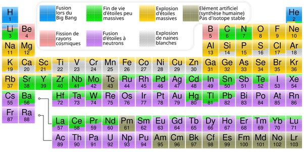

*Réponse publiée [sur Quora](https://fr.quora.com/Une-%C3%A9toile-produit-par-fusion-nucl%C3%A9aire-%C3%A0-partir-de-l-hydrog%C3%A8ne-de-l-h%C3%A9lium-puis-du-carbone-D-o%C3%B9-viennent-tous-les-autres-atomes-du-tableau-p%C3%A9riodique/answer/Dr-Goulu)*

Voir

[Nucléosynthèse](w:Nucléosynthèse)

Et le tableau périodique

Lisez aussi [Processus r — Wikipédia](w:Processus_r) et [Processus p — Wikipédia](w:Processus_p) et vous saurez presque tout.

En passant, la nucléosynthèse stellaire ne s'arrête de loin pas au carbone. Pour les grosses étoiles elle va jusqu'au fer.
