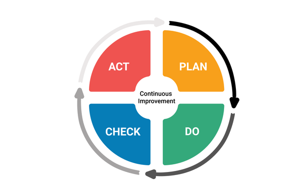

*Réponse publiée [sur Quora](https://fr.quora.com/Puisque-certaines-probl%C3%A9matiques-%C3%A9chappent-aux-limites-de-la-science-et-que-les-scientifiques-nont-pas-toujours-raison-ne-devrait-on-pas-consid%C3%A9rer-ces-d%C3%A9couvertes-comme-des-%C3%A9tapes-dans/answer/Dr-Goulu)*

Mais c'est exactement ça ! La [méthode scientifique](w:) est un cycle d'[amélioration continue](w:Roue_de_Deming) !

Seuls ceux qui ne connaissent pas la science croient qu'elle propose des vérités absolue. D'ailleurs en sciences on ne parle jamais de "vérité" et très peu d' "absolu".

Mais il est vrai que les scientifiques oublient parfois de commencer toutes leurs phrases par "jusqu'à preuve du contraire, tout se passe comme si…" parce que c'est évident pour eux.
