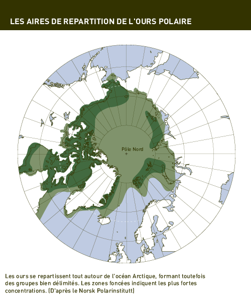

*Réponse publiée [sur Quora](https://fr.quora.com/Est-il-acceptable-que-l-Islande-ait-tu%C3%A9-un-ours-polaire-arriv%C3%A9-sur-un-iceberg-s-il-n-y-avait-pas-d-attaque-imminente-En-Inde-ils-ne-proc%C3%A8dent-pas-de-la-m%C3%AAme-mani%C3%A8re-avec-les-tigres-et/answer/Dr-Goulu)*

D'abord, l'[Ours blanc](w:)est classé seulement "VUlnérable" par l'UICN, alors que le [Tigre du Bengale](w:)est classé "EN danger" d'extinction .

Ensuite l'Islande ne fait pas partie de l'habitat usuel de l'ours polaire:

Comme vous je le regrette, mais les islandais ont préféré l'abattre plutôt que de le transporter au Groenland[[1]](#oQCUu). Je ne suis même pas sur que les danois auraient accepté. Les ours qui viennent fouiller dans les poubelles humaines sont souvent des vieux, plus capables de se nourrir normalement.

Notes de bas de page

[[1]](#cite-oQCUu)[Un ours polaire abattu par la police en Islande après avoir fouillé dans les poubelles d’un chalet](https://www.leparisien.fr/animaux/un-ours-polaire-abattu-par-la-police-en-islande-apres-avoir-fouille-dans-les-poubelles-dun-chalet-24-09-2024-VWCZEITTVNFNZC7MLHVRAMJ4RU.php)
