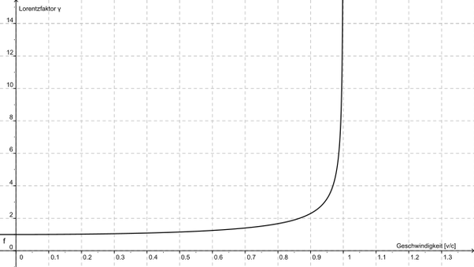

*Réponse publiée [sur Quora](https://fr.quora.com/Gravit%C3%A9-mise-%C3%A0-part-acc%C3%A9l%C3%A9rer-dans-l-espace-une-masse-de-10-%C3%A0-15-de-c-n%C3%A9cessite-t-il-la-m%C3%AAme-ou-plus-d-%C3%A9nergie-qu-il-en-a-fallu-pour-acc%C3%A9l%C3%A9rer-celle-ci-de-5-%C3%A0-10-de-c/answer/Dr-Goulu)*

À peine plus. C'est nettement plus vite que le [Facteur de Lorentz](w:)se fait bien sentir

