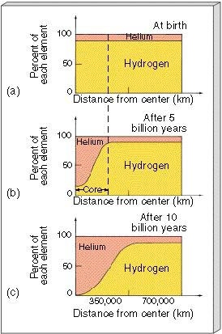

*Réponse publiée [sur Quora](https://fr.quora.com/Pourquoi-est-il-affirm%C3%A9-que-le-soleil-ne-fusionnera-l-h%C3%A9lium-que-lorsque-tout-l-hydrog%C3%A8ne-sera-fusionn%C3%A9/answer/Dr-Goulu)*

Qui affirme ça ? C'est faux.

Le [Flash de l'hélium](w:)se produit dans les étoiles entre 0.5 et 2 masses solaires lorsque la fusion de l'hydrogène ne produit plus assez de pression de radiation pour empêcher l'effondrement gravitationnel du cœur, majoritairement composé d'hélium

(Source [Chapter 20, Section 2](http://lifeng.lamost.org/courses/astrotoday/CHAISSON/AT320/HTML/AT32002.HTM))
