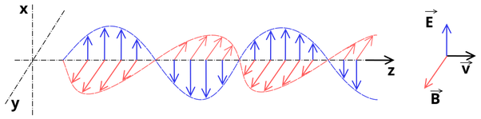

*Réponse publiée [sur Quora](https://fr.quora.com/L%C3%A9mission-de-la-lumi%C3%A8re-aurait-deux-dimensions-de-mouvement-une-constante-rectiligne-%C3%A0-300000-km-s-une-autre-circulaire-ou-h%C3%A9lico%C3%AFdal-quelle-serait-la-vitesse-de-cette-derni%C3%A8re/answer/Dr-Goulu)*

Non, ce n'est pas du "mouvement", rien ne bouge, sauf le [Photon](w:)dans le sens axial.

L'[Onde électromagnétique](w:)est un modèle, une représentation mathématique d'un phénomène pour lequel les mots et les dessins ne conviennent pas.

Notamment, l'oscillation des champs électrique et magnétique n'ont pas d'amplitude définie comme dans ce joli dessin

Ce modèle résulte des équations de Maxwell et suggère que le photon a une "amplitude" alors que la mécanique quantique constate expérimentalement que seule la fréquence joue un rôle physique.

En MQ, l'amplitude est une "fonction d'onde" est une probabilité de mesurer le photon à cet endroit. Elle vaut 1 sur tout l'espace de tout l'univers, mais la probabilité de détecter le photon est vachement plus élevée sur la géodésique que 1 micron à côté.

Il faut beaucoup, BEAUCOUP de photons pour que cette amplitude fasse bouger un électron dans une antenne

[https://www.reddit.com/r/askscie...](https://www.reddit.com/r/askscience/s/MWBOe7eAJ5)
