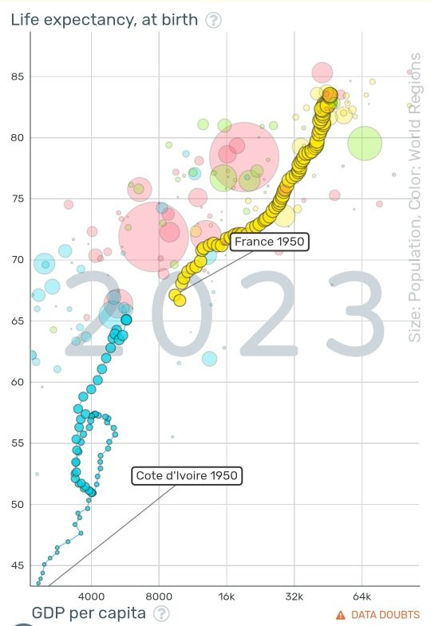

*Réponse publiée [sur Quora](https://fr.quora.com/Le-sous-d%C3%A9veloppement-de-la-c%C3%B4te-d-ivoire-est-elle-fatalit%C3%A9/answer/Dr-Goulu)*

Selon le génial [Gapminder Tools](https://www.gapminder.org/tools/#$model$markers$bubble$encoding$y$scale$zoomed@:46.41&:85.6;;;&x$scale$zoomed@:3189.64&:78717.44;;;&trail$data$filter$markers$fra=1950&civ=1950;;;;;;;;&chart-type=bubbles&url=v2) de Hans Rosling, la Côte d'Ivoire suit une trajectoire de développement tout à fait normale à l'exception d'un recul de l'espérance de vie de 1987 à 1999 (sida ?)

Sa situation actuelle est comparable à la France de 1950.

Patience et continuez comme ça.
