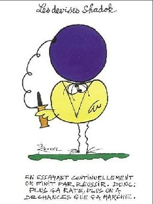

*Réponse publiée [sur Quora](https://fr.quora.com/Est-ce-que-l-%C3%A9nergie-noire-est-une-vitesse-vibratoire-qui-peut-%C3%AAtre-sup%C3%A9rieure-%C3%A0-la-vitesse-de-la-lumi%C3%A8re-dans-le-vide/answer/Dr-Goulu)*

Non.

La physique n'est pas un jeu de devinettes. Ça ne marche pas comme ça :

Une vitesse se mesure en m/s et une énergie en kg.m²/s², donc votre hypothèse est fausse dès la première phrase.
