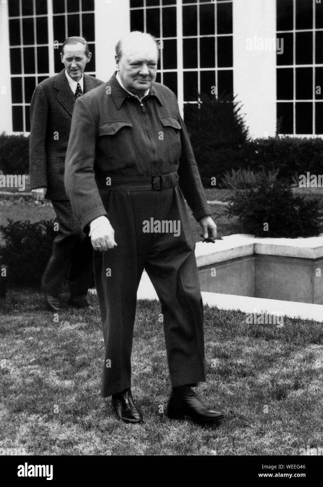

*Réponse publiée [sur Quora](https://fr.quora.com/Que-pensez-vous-du-pr%C3%A9sident-Ukrainien-qui-porte-un-T-shirt-et-est-mal-ras%C3%A9-Pensez-vous-que-c-est-une-bonne-id%C3%A9e-pour-le-moral-Que-pr%C3%A9f%C3%A9reriez-vous-que-fasse-votre-dirigeant-en-tant-de/answer/Dr-Goulu)*

J'aimerais qu'il ressemble à ce type, invité à la Maison Blanche en 1941

Parce qu'il a gagné la guerre contre un sale dictateur mégalomane qui attaquait son pays en bombardant les civils.

La seule différence, c'est que Winston Churchill a été accueilli très poliment par un président des USA éduqué, et très compréhensif car il venait de se faire défoncer à Pearl Harbor après deux ans d'inaction.
