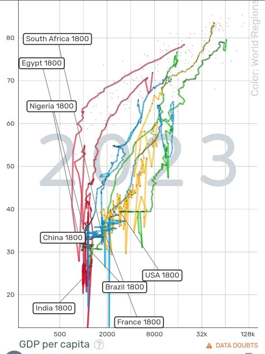

*Réponse publiée [sur Quora](https://fr.quora.com/Pourquoi-lAfrique-ne-se-devellope-pas-vite/answer/Dr-Goulu)*

Parce que le développement suit partout les mêmes étapes, au même rythme. Il y a simplement un décalage dans le temps.

1. minimum d'hygiène et de vaccination
2. Éducation des filles
3. [Transition démographique](w:). La moitié des pays africains ont atteint cette étape fondamentale

L'Europe s'est développée au début du 20ème siècle, l'Asie et l'Amérique du Sud à la fin, et l'Afrique maintenant.

Source [Gapminder Tools](https://www.gapminder.org/tools/#$model$markers$bubble$encoding$size$data$constant=_default;&scale$domain:null&type:null&zoomed:null&extent@:0&:0;;;&y$scale$zoomed@:17.74&:86.64;;;&x$scale$zoomed@:300&:84105.86;;;&trail$data$filter$markers$fra=1800&usa=1800&bra=1800&chn=1800&ind=1800&zaf=1800&nga=1800&egy=1800;;;;;;;;&chart-type=bubbles&url=v2)
