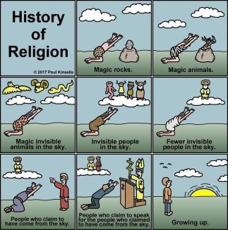

*Réponse publiée [sur Quora](https://fr.quora.com/Au-final-la-science-n-est-elle-pas-une-forme-de-religion-au-final-ou-l-ont-croit-en-la-recherche-de-la-v%C3%A9rit%C3%A9/answer/Dr-Goulu)*

Non. La science ne recherche pas la vérité. Elle cherche la description la plus cohérente possible des faits observables.

La religion ne cherche rien du tout, elle répète ce qu'un type a rêvé concernant des êtres fictifs.

