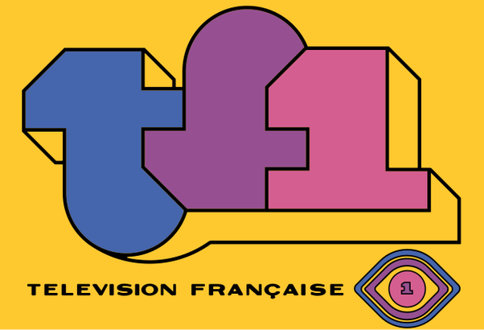
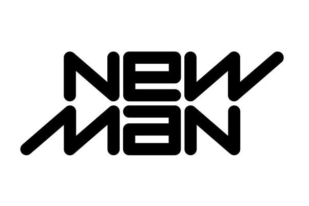

*Réponse publiée [sur Quora](https://fr.quora.com/Qui-se-souvient-du-logo-ambigramme-de-TF1-%C3%A0-la-fin-des-ann%C3%A9es-80/answer/Dr-Goulu)*

Moi, mais ce n'était pas vraiment un [ambigramme](w:), il n'y a que le t et le f qui sont symétriques.

(Logo de TF1 de janvier 1975 à janvier 1985, Auteur:Catherine Chaillot)

Les ambigrammes étaient à mode à l'époque. Je pense que ça a commencé avec ce logo créé par [Raymond Loewy](w:) en 1969 :

