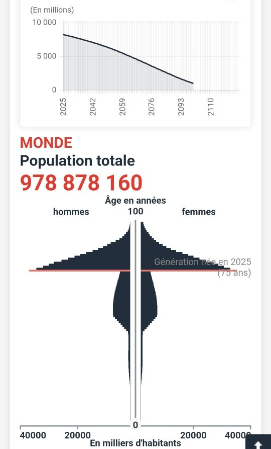
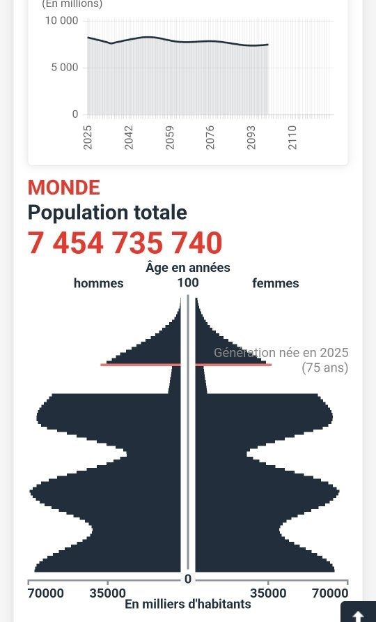

*Réponse publiée [sur Quora](https://fr.quora.com/Si-l-on-supprimait-90-des-naissances-partout-dans-le-monde-d-ici-10-ans-cela-solutionnerait-il-le-probl%C3%A8me-de-l-immigration-et-les-angoisses-%C3%A9cologiques/answer/Dr-Goulu)*

Si vous descendez le nombre d'enfants par femme de 2.3 actuellement à 0.23, la population descend à 1 milliard vers 2100, mais vous remplacez votre "problème de l'immigration" (qui est très local à la France) et les problèmes écologiques (bien réels) par un gigantesque "problème des retraites" à l'échelle planétaire, que vous pouvez deviner d'après la pyramide des âges obtenues :

Ensuite vous avez intérêt à réaugmenter la natalité pour éviter l'extinction.

Si vous ne pensiez diminuer la natalité que pendant 10 ans, ça donne ça :

Vous diminuez à peine la population actuelle, en causant de terribles oscillations dans la pyramide des âges qui vous condamnent à construire des écoles, puis des ehpads, puis des écoles, puis des ehpads etc pendant 2 ou 3 siècles.

Si vous voulez joueur au dictateur démographe, vous pouvez vous aussi jouer avec [le simulateur de population de l'INED](https://www.ined.fr/fr/tout-savoir-population/jeux/population-demain/)
