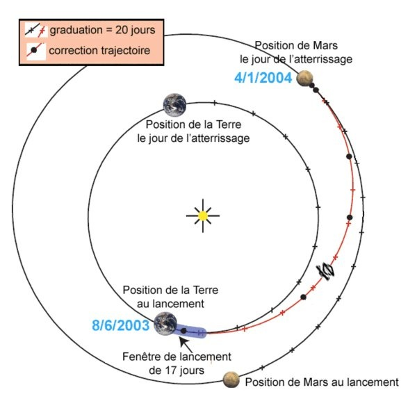

*Réponse publiée [sur Quora](https://fr.quora.com/Comment-pourrait-on-envoyer-une-fus%C3%A9e-sur-Mars-Jaimerais-savoir-les-propri%C3%A9t%C3%A9s-de-cette-fus%C3%A9e-et-pouvez-vous-me-d%C3%A9finir-les-calculs-de-trajectoire-svp-%E0%B2%A5-%E0%B2%A5/answer/Dr-Goulu)*

De nombreuses fusées ont déjà été envoyé sur Mars.

La première a été une fusée russe [Proton](w:Proton_(fusée))-K avec bloc D lancée en 1971 qui a posé l'attérisseur [Mars 3](w:).

Vous trouverez plein d'informations sur les vols suivants sur la page sur [Exploration du système martien — Wikipédia](w:Exploration_du_système_martien)

La trajectoire est toute simple :

(Source et explications [Mars Exploration Rover - Le trajet Terre-Mars](https://www.techno-science.net/glossaire-definition/Mars-Exploration-Rover-page-5.html))
