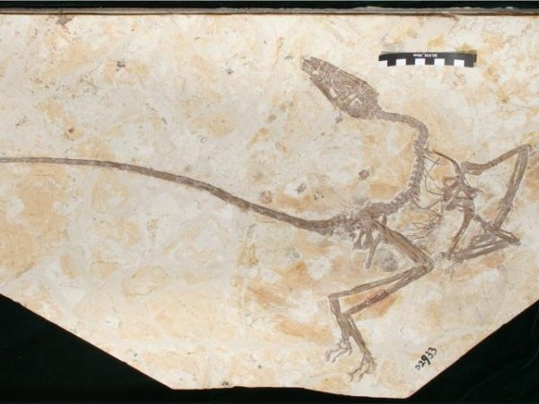
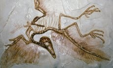
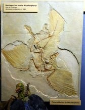

*Réponse publiée [sur Quora](https://fr.quora.com/Y-avait-il-des-dinosaures-avec-des-ailles-Si-oui-quelle-d%C3%A9couverte-prouve-cela/answer/Dr-Goulu)*

Il y a plein de fossiles de dinosaures avec des plumes (qui sont des écailles modifiées pour faire joli), puis plein de (petits) dinosaures avec des ailes de plus en plus grandes.

D'autre part le squelette des oiseaux a plein de particularités qu'on ne retrouve que chez les dinosaures

Voilà de la lecture:

[https://fr.wikipedia.org/wiki/Hi...](w:Histoire_évolutive_des_oiseaux)

Et aussi des images de fossiles :

