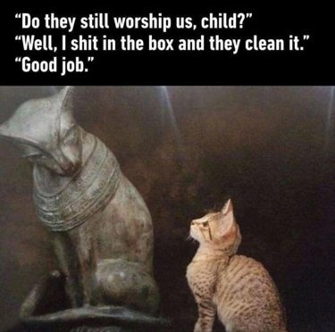

*Réponse publiée [sur Quora](https://fr.quora.com/Pourquoi-le-chat-est-un-animal-de-compagnie-r%C3%A9pandu-alors-qu-il-ne-sert-techniquement-%C3%A0-rien/answer/Dr-Goulu)*

Vous inversez les rôles. C'est nous qui servons les chats. Nous les nourrissons avec de la pâtée au saumon, vidons leur caisse, les avons introduits sur tous les continents où ils ont pu déployer leurs talents de prédateurs.

