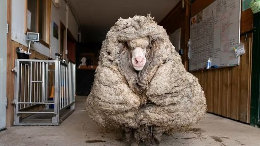
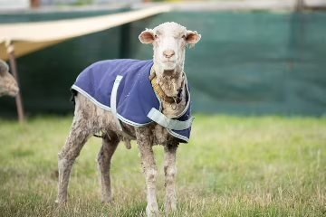

*Réponse publiée [sur Quora](https://fr.quora.com/Un-individu-d-une-esp%C3%A8ce-domestiqu%C3%A9e-a-t-il-dej%C3%A0-retrouv%C3%A9-un-%C3%A9tat-de-sauvagerie/answer/Dr-Goulu)*

Très souvent.

Mon préféré c'est Baarack :

Après 5 ans dans la nature :

[Australie : un mouton errant est tondu et est allégé de 35 kilos de laine](https://www.francetvinfo.fr/monde/pacifique/australie-un-mouton-est-tondu-et-perd-35-kilos-de-pelage_4310321.html)

De retour à la civilisation :

