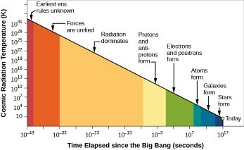

*Réponse publiée [sur Quora](https://fr.quora.com/L-espace-et-le-temps-existaient-ils-avec-la-singularit%C3%A9/answer/Dr-Goulu)*

Quelle singularité ?

Les singularités sont des objets mathématiques, jusqu'à preuve du contraire ça n'existe pas en physique.

En physique, on change d'unités pour éviter des problèmes mathématiques.

Pour le Big Bang, remplacez le temps par la température, l'entropie, ou le log ou l'inverse de ces grandeurs et ya plus de singularité :

