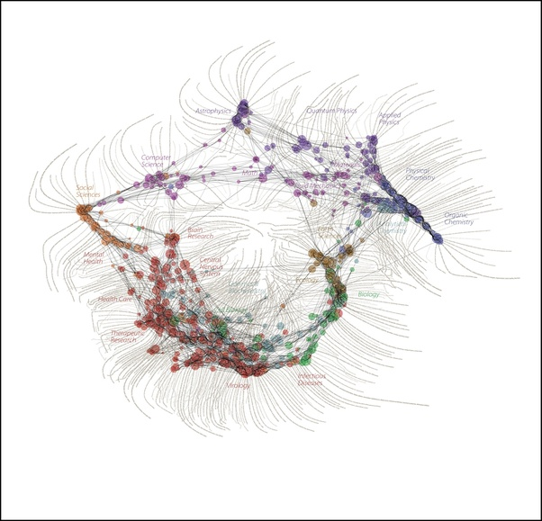

*Réponse publiée [sur Quora](https://fr.quora.com/Quelle-est-la-partie-la-plus-importante-de-la-science/answer/Dr-Goulu)*

La [Méthode scientifique](w:).

Il n'y a pas de "partie", le savoir est très interconnecté

[Carte des Sciences - Pourquoi Comment Combien](/2007/06/07/carte-des-sciences/)
