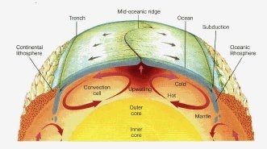

*Réponse publiée [sur Quora](https://fr.quora.com/Comment-les-plaques-tectoniques-peuvent-elle-se-d%C3%A9placer-au-m%C3%AAme-moment-que-la-terre-tourne/answer/Dr-Goulu)*

Ça n'a pas grand chose à voir (l'effet Coriolis est négligeable en [Tectonique des plaques](w:).

Les plaques se déplacent (lentement) sous l'effet de courants de convection du manteau.

La tectonique des plaques est donc alimentée par la chaleur de la planète.
