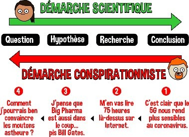

*Réponse publiée [sur Quora](https://fr.quora.com/Des-termes-comme-pseudoscience-th%C3%A9orie-du-complot-etc-sont-ils-tout-simplement-de-l-h%C3%A9r%C3%A9sie-puisque-la-science-moderne-est-comme-la-religion-organis%C3%A9e-d-il-y-a-des-si%C3%A8cles-comme-le/answer/Dr-Goulu)*

Si vous voyez des ponts communs entre la science actuelle et la religion d'il y a des siècles, c'est probablement que vous connaissez aussi bien l'une que l'autre.

La différence avec le complotisme est par contre assez facile à expliquer :

[https://lepharmachien.com/conspi...](https://lepharmachien.com/conspirations/)
