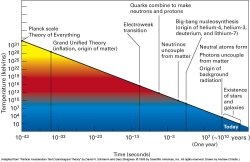

*Réponse publiée [sur Quora](https://fr.quora.com/Si-linstant-t-0-correspond-%C3%A0-lapparition-du-temps-et-de-lespace-alors-lunivers-a-surgi-du-n%C3%A9ant/answer/Dr-Goulu)*

C'est quoi l'instant t=0 ?

Comment mesurez-vous le temps dans un plasma quark-gluon ?

Si vous mesurez le "temps" par des grandeurs physiques pendant ces [ères](w:Histoire_et_chronologie_de_l'Univers), il n'y a pas de t=0.

Et c'est quoi le "néant". Montrez moi ça aussi svp. Juste une petite fiole qui ne contienne même pas du [Vide quantique](w:). Parce que dans le vide quantique il se produit des fluctuations, et que si ce vide est aussi vide qu'il le sera dans des milliards de milliards de milliards d'années, ben une de ces fluctuations peut produire à un nouveau "Big Bang".
