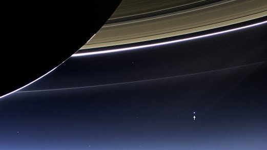

*Réponse publiée [sur Quora](https://fr.quora.com/Quelle-photo-de-la-NASA-vous-a-le-plus-marqu%C3%A9/answer/Dr-Goulu)*

Celle là

Le petit point bleu c'est la Terre, photographiée depuis l'orbite de Saturne par la sonde Cassini en 2013.

[The Day the Earth Smiled - NASA](https://www.nasa.gov/image-article/day-earth-smiled/)
