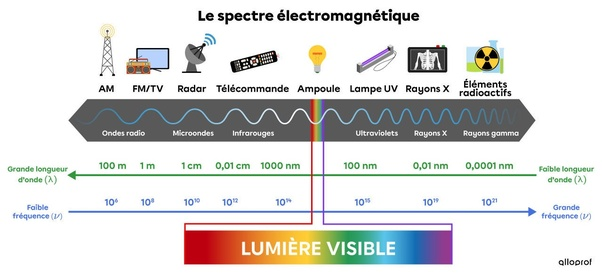
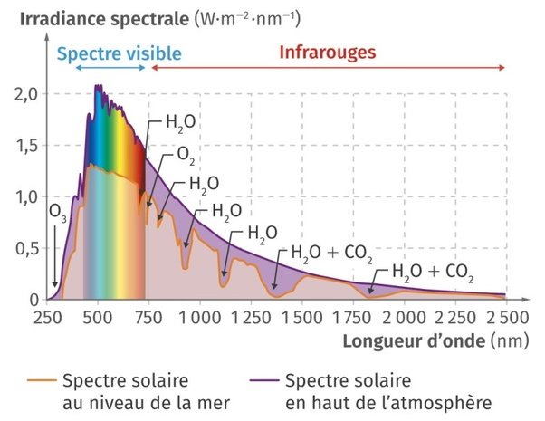

*Réponse publiée [sur Quora](https://fr.quora.com/Bonjour-la-lumiere-est-elle-la-m%C3%AAmes-chose-que-l-%C3%A9lectromagn%C3%A9tisme-car-le-rayonnement-dune-ampoules-et-un-%C3%A9tat-de-lumi%C3%A8re-%C3%A9lectromagn%C3%A9tisme-modifi%C3%A9/answer/Dr-Goulu)*

Absolument. La lumière (visible) n'est qu'une étroite bande de fréquences des ondes électromagnétiques.

(source : [Le spectre électromagnétique](https://www.alloprof.qc.ca/fr/eleves/bv/sciences/le-spectre-electromagnetique-s1137) )

L'évolution fait que cette bande de fréquences perceptible "facilement" avec de petits yeux coïncide au pic d'émission de notre étoile :

