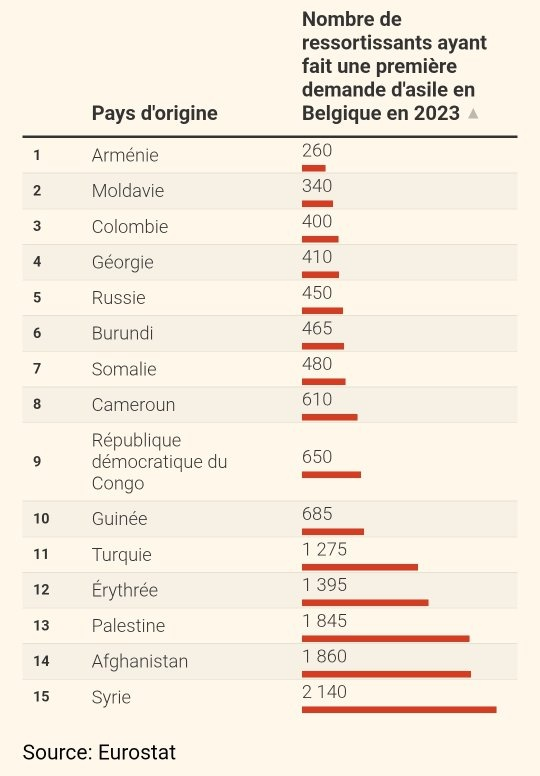

*Réponse publiée [sur Quora](https://fr.quora.com/Comment-se-fait-il-que-tant-de-demandeurs-d-asile-en-Belgique-soient-Marocains-ou-Alg%C3%A9riens-alors-que-leur-pays-nest-pas-en-guerre/answer/Dr-Goulu)*

Je me demande bien d'où viennent vos informations. Ni l'Algérie ni le Maroc ne sont dans le top 15 des nationalités de demandeurs d'asile en Belgique.

Je vois surtout des pays en conflit là dedans (et un classement à la belge…)

[https://www.lecho.be/economie-po...](https://www.lecho.be/economie-politique/belgique/federal/les-vrais-chiffres-de-la-crise-de-l-asile-en-belgique/10496075.html#:~:text=4/ D'où viennent les,et les Turcs (1.275)).
