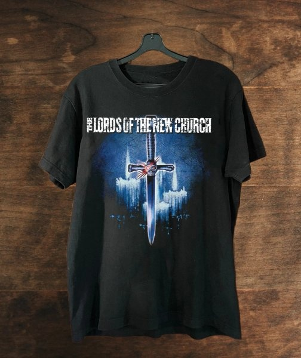

*Réponse publiée [sur Quora](https://fr.quora.com/Que-r%C3%A9pondez-vous-aux-t%C3%A9moins-de-J%C3%A9hovah-mormons-et-autres-%C3%A9nergum%C3%A8nes-qui-viennent-vous-importuner-jusque-chez-vous-avec-leur-obscurantisme/answer/Dr-Goulu)*

Quand je passe l'aspirateur, je mets la musique à coin. Premier coup du sort, les témoins de Jéhovah ont sonné alors que j'étais près de la porte, alors je les ai entendus et leur ai ouvert avec :

[https://open.spotify.com/track/3...](https://open.spotify.com/track/3tq0RONoc1VcD1jIaJUZtt?si=7TeBz6GyRsujV2glQtpyVg)

à fond, vêtu du t-shirt assorti

(oui j'étais un fan, et j'écoute encore volontiers)

Ils ont quand même commencé par me proposer la parole du saigneur, mais je leur ai dit du tac au tac "désolé, mais comme vous voyez j'ai déjà vendu mon âme au diable". Ils ont disparu instantanément.

Vous n'allez pas le croire, mais après je ne les ai JAMAIS revus à ma porte en 40 ans et 5 déménagements. Je suis persuadé qu'ils ont une liste noire, eux aussi…
