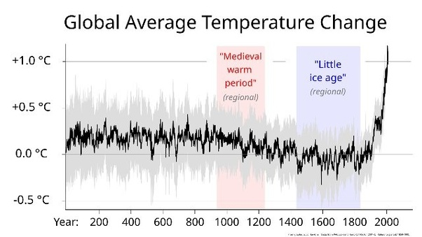
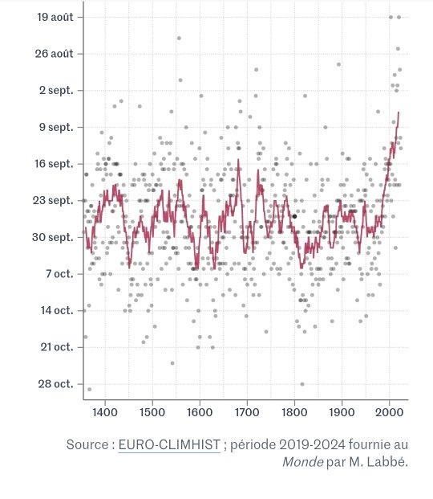

*Réponse publiée [sur Quora](https://fr.quora.com/A-t-on-une-id%C3%A9e-de-la-temp%C3%A9rature-en-Europe-au-haut-moyennage-quand-en-Angleterre-on-cultivait-la-vigne-et-produisait-du-Vin-et-qu-en-France-des-fraises-poussaient-en-hivers-Pourquoi-ce/answer/Dr-Goulu)*

Références pour les, fraises en hiver siouplait ? Et sur la qualité du vin anglais ?

L'[Optimum climatique médiéval](w:)correspond en effet à une période anormalement chaude en Europe occidentale. Les mesures ailleurs dans le monde ne conforment pas qu'elles aient été globales, c'est pourquoi on suspecte plutôt une modification du Gulf Stream.

Les températures moyennes en Europe durant l'optimum correspondait environ à celles des années 1990, mais pas à celles du début du 21ème siècle.

JAMAIS les températures GLOBALES n'ont augmenté aussi vitre que maintenant.

La derniere fois qu'il a fait aussi chaud que maintenant sur l'ensemble de la planète, c'était il y a 2 millions d"annles.

Il n'y a aucun silence, juste des gens qui ne lisent pas les publications scientifiques.

Maintenant si vous aimez le vin, vous pouvez consulter [La date des vendanges à Beaune](https://www.lemonde.fr/climat/article/2024/09/16/la-date-des-vendanges-a-beaune-temoin-du-changement-climatique_6319877_1652612.html)

Elle ne remonte hélas pas à l'optimum climatique, et elle est locale, mais c'est peut être une mesure que vous êtes plus capable de comprendre qu'un rapport du GIEC.
