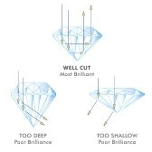

*Réponse publiée [sur Quora](https://fr.quora.com/Hormis-la-taille-quest-ce-qui-explique-quun-diamant-brille-autant-Une-histoire-dindice/answer/Dr-Goulu)*

Les deux vont de pair : la taille exploite le haut indice de réfraction (2,4) pour créer des réflexions totales à l'intérieur de la pierre pour augmenter sa brillance.

Ce n'est qu'au 20ème siècle qu'on a développé des tailles basées sur les connaissances scientifiques

Source avec texte très intéressant : [L'importance d'un diamant bien taillé](https://www.beldiamond.com/fr/blogs/guidance/why-a-diamond-s-cut-is-so-important)

Si vous regardez des bijoux anciens, même des diamants remarquables ont l'air assez ternes. Ce qui explique que le diamant n'était pas aussi apprécié que les pierres de couleur comme le rubis ou l'émeraude.
