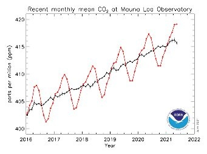

*Réponse publiée [sur Quora](https://fr.quora.com/Comment-va-t-on-sortir-de-la-crise-climatique-En-mettant-des-millions-de-pompes-%C3%A0-carbone/answer/Dr-Goulu)*

Les "pompes à carbone" existent, ce sont les arbres.

Regardez ce graphique :

C'est la mesure de la concentration de CO2 prise à Hawaii, pour que l'air soit bien brassé.

La courbe noire est la valeur lissée, qui augmente encore et encore.

La courbe rouge est la mesure lissée sur une semaine.

Comme vous le voyez, la valeur oscille très régulièrement autour de la valeur lissée, avec une période d'une année. Et elle BAISSE carrément pendant l'été dans l'hémisphère nord, qui possède nettement plus de terres couvertes de végétation que l'hémisphère sud.

Cette baisse, c'est l'effet de la photosynthèse.

Il faudrait donc BEAUCOUP plus d'arbres et de végétation, et en couper un max en automne pour fixer le carbone.

L'idéal, ce serait les glands magiques de Panoramix…

Et en plus ces "pompes à carbone" naturelles se multiplient toutes seules.

La reforestation est donc la plus simple des mesures de [Géoingénierie](w:) que nous pouvons prendre.

Dans la même veine mais avec des conséquences énormes, il y a diverses idées pour fertiliser les algues océaniques (avec du fer notamment) ou favoriser la capture du CO2 par les coraux.

En dernier recours, il y aurait des projets titanesques au coût pharamineux comme un [Parasol spatial](w:).

Le danger d'évoquer la géoingénierie, c'est que ça donne des excuses pour continuer à émettre du CO2.

Or il faut le répéter : la solution la plus simple et la moins chère, c'est de réduire nos émissions.
