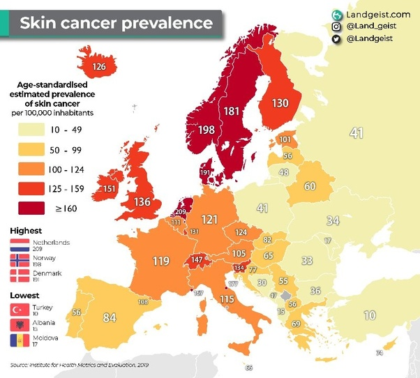

*Réponse publiée [sur Quora](https://fr.quora.com/Les-cancers-de-la-peau-sont-ils-plus-fr%C3%A9quents-en-Europe-du-Sud-qu-en-Europe-du-Nord/answer/Dr-Goulu)*

Non, c'est paradoxalement le contraire

(Source : [Skin Cancer Prevalence in Europe](https://landgeist.com/2023/07/22/skin-cancer-prevalence-in-europe/)- [Landgeist](http://landgeist.com).com)

La raison est probablement double voire triple :

- Peau plus claire au nord
- Moins de prévention dans les pays du nord
- Vacances des nordistes au sud.
