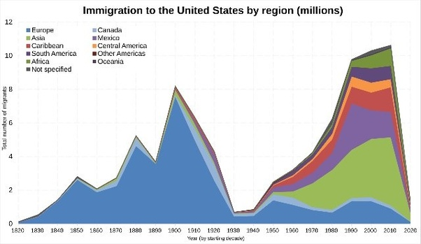

*Réponse publiée [sur Quora](https://fr.quora.com/Depuis-que-lhomme-a-mis-les-pieds-aux-%C3%89tats-Unis-quel-est-le-pays-o%C3%B9-le-plus-dHommes-sont-partis-pour-le-r%C3%AAve-am%C3%A9ricain/answer/Dr-Goulu)*

Bonne question, et bizarrement on ne trouve pas facilement de réponse claire.

Sur [United States immigration statistics - Wikipedia](w:en:United_States_immigration_statistics) on trouve ce graphique

Qui mélange un peu les régions (Europe en bleu foncé, Asie en vert clair) et les pays (Mexique, en violet).

La page [What the data says about immigrants in the U.S.](https://www.pewresearch.org/short-reads/2025/08/21/key-findings-about-us-immigrants/) donne des chiffres plus détaillés par pays pour les différentes périodes d'immigration, mais en chiffres absolus c'est le Mexique.

Petit rappel historique au passage : [Traité de Guadalupe Hidalgo](w:)
