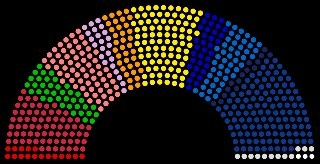

*Réponse publiée [sur Quora](https://fr.quora.com/Pourquoi-Macron-nommerait-un-gouvernement-socialiste-selon-les-journalistes-alors-que-les-fran%C3%A7ais-veulent-en-tr%C3%A8s-grande-majorit%C3%A9-un-vrai-virage-%C3%A0-droite/answer/Dr-Goulu)*

Relisez votre constitution. Ce n'est pas ce que vous croyez que les français veulent en très grande majorité qui compte, mais une petite majorité à l'[Assemblée nationale](w:Assemblée_nationale_(France)).

Alors vous regardez bien cette image

Et vous voyez que les bleus à droite sont exactement aussi nombreux que les oranges à rouge, et donc que les jaunes sont les arbitres.
