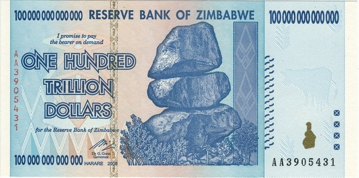

*Réponse publiée [sur Quora](https://fr.quora.com/Pourquoi-les-%C3%89tats-ne-sont-pas-capables-de-fabriquer-largent-en-quantit%C3%A9s-pour-subvenir-leurs-besoin/answer/Dr-Goulu)*

Mais ils en sont parfaitement capables :

Voilà un billet de 100'000 milliards de [Dollar du Zimbabwe](w:). Cool pour rembourser la dette, non ? Sauf, que ce billet s'échangeait contre 30 dollars américains lors de son émission, et plus rien le lendemain.

A propos de "subvenir à ses besoins", le billet d'un million de dollars devait valoir moins qu'un coupon de papier toilette…

Si vous "fabriquez de l'argent" sans créer de valeur correspondante, vous ne fabriquez que de l'inflation.
