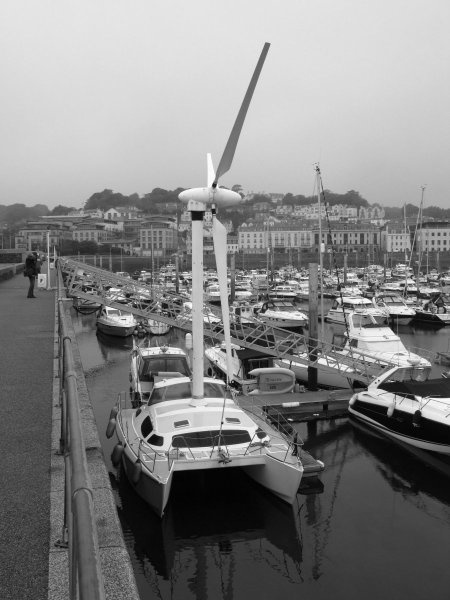

*Réponse publiée [sur Quora](https://fr.quora.com/Peut-on-remplacer-les-voiles-des-bateaux-par-des-turbines-qui-par-l-intermediaire-de-transmission-m%C3%A9canique-pourraient-faire-tourner-des-h%C3%A9lices/answer/Dr-Goulu)*

Comme ça ?

Oui on peut.

Avantage : on peut remonter faca au vent

Inconvénients :

- Difficile de réduire la voilure dans la tempête
- Le mat ne peut plus être haubané, il doit être plus massif et la fixation à la coque bien plus solide que pour un mât de voilier
- Le centre de gravité du bateau est plus haut, donc le bateau moins stable.
