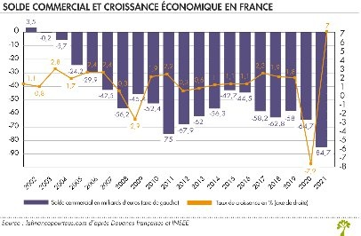

*Réponse publiée [sur Quora](https://fr.quora.com/Pourquoi-la-France-a-telle-subit-une-perte-%C3%A9conomique-de-10-milliards-deuros-en-2025-par-ces-temps-o%C3%B9-lon-est-%C3%A0-la-recherche-de-la-moindre-%C3%A9conomie-Cest-quoi-ces-%C3%A9conomies-de-bouts-de/answer/Dr-Goulu)*

Votre [Balance commerciale](w:)est encore légèrement déficitaire, mais c'était beaucoup plus dans les 20 dernières années.

(Source et explications : [[1]](#ERksr))

C'est du à la désindustrialisation qui vous a forcés à acheter plus de produits étrangers que vous n'en avez vendus. Vous avez donc fait de grosses économies en achetant moins à l'étranger (surtout de l'énergie) et en vendant plus.[[2]](#pzkMu)

Passer de 80 milliards de déficit à 10 c'est pas des bouts de chandelle, c'est quasi 1000 euros de gagnés par français !

Ce qui vous sauve encore un peu, ce sont les services et notamment le tourisme, qui font que la [balance des paiements](w:) est à nouveau positive .[[3]](#UfQMG)

C'est pourquoi VOS GREVES SONT UNE MONSTRUEUSE CONNERIE.

A chaque fois vous tuez une poule aux œufs d'or en décourageant les visiteurs. La France est toujours no 1 de la [Liste des destinations touristiques mondiales](w:), mais elle perd des visiteurs au profit de l'Espagne et de l'Italie.

(et attention à ne pas confondre le déficit public, qui était de 170 milliards[[4]](#dnsUd) avec ce qui précède. Ça n'a rien à voir mais montre la différence entre l'économie de toute la France qui ne va pas si mal que ça, et celle de l'Etat, qui va TRES mal)

Notes de bas de page

[[1]](#cite-ERksr)[Balance commerciale de la France : faut-il s'inquiéter ?](https://www.lafinancepourtous.com/2022/02/18/faut-il-sinquieter-du-deficit-record-de-la-balance-commerciale-de-la-france/)

[[2]](#cite-pzkMu)[Rapport 2024 sur le commerce extérieur de la France](https://www.tresor.economie.gouv.fr/Articles/2024/02/07/rapport-2024-sur-le-commerce-exterieur-de-la-france)

[[3]](#cite-UfQMG)[La balance des paiements et la position extérieure | Banque de France](https://www.banque-france.fr/fr/publications-et-statistiques/statistiques/balance-paiements)

[[4]](#cite-dnsUd)[En 2024, le déficit public s’élève à 5,8 % du PIB, la dette publique à 113,0 % du PIB - Informations rapides - 81](https://www.insee.fr/fr/statistiques/8540375)
