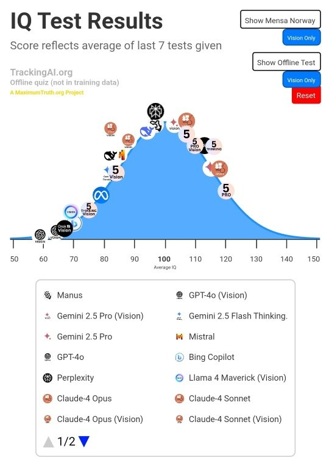

*Réponse publiée [sur Quora](https://fr.quora.com/Est-ce-que-lintelligence-artificielle-va-depasser-lintelligence-naturelle/answer/Dr-Goulu)*

Ça dépend comment vous mesurez l'intelligence.

Si vous mesurez par le QI, les IA actuelles ont des QI comparables aux humains moyens et faibles, mais les dernières IA sont autour de 120…

(Source [Tracking AI](https://www.trackingai.org/))

Personnellement j'aime beaucoup l'idée développée dans un article que je ne retrouve hélas plus de mesurer l'intelligence par le temps sur lequel un individu peut planifier ses actions pour atteindre un but. Il passe de zéro à quelques heures chez un enfant humain, puis quelques jours à quelques mois, rarement des années chez l'adulte. Certains animaux atteignent quelques minutes.

Pour les IA, j'espère qu'elles n'ont absolument pas cette faculté. Si elles l'ont, on le saura au Judgement Day…
