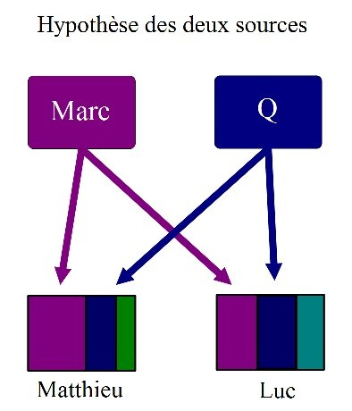

*Réponse publiée [sur Quora](https://fr.quora.com/%C3%80-votre-avis-sur-quels-t%C3%A9moignages-oculaires-l-%C3%89vangile-selon-Matthieu-est-il-bas%C3%A9-Comment-peut-on-le-prouver/answer/Dr-Goulu)*

Aucun. L'[Évangile selon Matthieu](w:)a été écrit dans les années 80, directement en grec, langue qu'aucun disciple direct de Jésus ne maîtrisait, et reprend beaucoup de l'évangile de Marc (65-75) additionné le la [Source Q](w:)commune à Matthieu et Luc.

([Théorie des deux sources — Wikipédia](w:Théorie_des_deux_sources))
