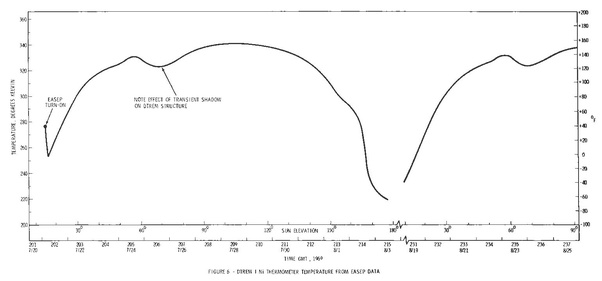

*Réponse publiée [sur Quora](https://fr.quora.com/En-1969-les-astronautes-ont-ils-foul%C3%A9-le-sol-lunaire-sur-la-face-o%C3%B9-il-fait-120-c-ou-sur-celle-o%C3%B9-il-fait-130c/answer/Dr-Goulu)*

Vous pouvez répondre à votre propre question juste en observant les photos prises sur la Lune. Les objets ont une ombre, donc ça c'est passé sur la face éclairée.

Mais regardez mieux les ombres : elles sont très longues. Donc les alunissages (il y en a eu 6, pas seulement en 1969…) ont tous eu lieu près du [Terminateur](w:) exactement pour la raison que vous mentionnez : le sol n'a pas eu le temps de trop se réchauffer depuis le moment où il était à l'ombre.

Selon le relevé de l'instrument déposé sur la Lune par l'équipage d'Apollo 11, la température pendant les 20 et 21 juillet a augmenté de -23 à +7°C, donc tout à fait vivable avec de bonnes "moon boots" :

Vachement malins ces ingénieurs de la NASA, non ?
