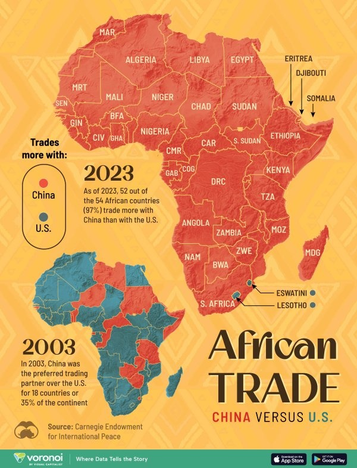

*Réponse publiée [sur Quora](https://fr.quora.com/Pourquoi-trump-s-en-prends-t-il-au-Lesotho-maintenant-N-a-t-il-pas-encore-assez-d-ennemis/answer/Dr-Goulu)*

Parce que le Lesotho fait partie des deux derniers pays africains à faire plus de commerce avec les USA qu'avec la Chine.

Il faut donc le dégouter aussi.

[https://www.visualcapitalist.com...](https://www.visualcapitalist.com/u-s-vs-china-mapping-trade-dominance-in-africa-2003-2023/)
