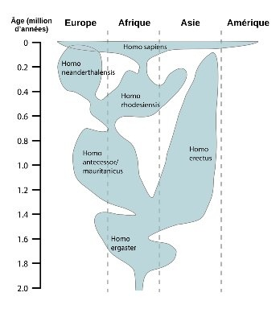

*Réponse publiée [sur Quora](https://fr.quora.com/Si-un-groupe-d-homo-sapiens-%C3%A9tait-rest%C3%A9-isol%C3%A9-pendant-des-milliers-d-ann%C3%A9es-sans-s-etre-m%C3%A9lang%C3%A9-avec-d-autres-humains-formerait-il-de-nos-jours-une-esp%C3%A8ce-%C3%A0-part/answer/Dr-Goulu)*

Non, des milliers d'années ce n'est pas assez long.

Sur la page [Homo — Wikipédia](w:Homo) on trouve cette figure qui montre notamment qu'après plus de 300'000 ans, l'homme de Néandertal a pu s'hybrider avec Sapiens, alors qu'Erectus n'a pas pu le faire après un million d'années de séparation.

Il faudrait donc des centaines de milliers d'années de séparation pour une spéciation.
