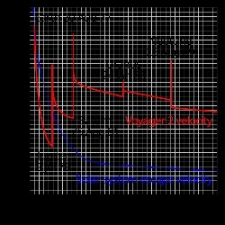

*Réponse publiée [sur Quora](https://fr.quora.com/Est-on-capable-aujourdhui-de-cr%C3%A9er-un-engin-qui-pourrait-rattraper-les-sondes-Voyager/answer/Dr-Goulu)*

Avec un [Moteur ionique](w:) oui, certainement.

Mais il faudrait attendre une disposition favorable des planètes extérieures, au moins Jupiter et Saturne, pour bénéficier de leur [Assistance gravitationnelle](w:).

Sans ça les sondes Voyager ne pourraient pas quitter le système solaire, et une sonde ionique non plus.

Si en plus vous voulez les rattraper en allant dans la même direction, il faudra utiliser Uranus ou Neptune pour vous dévier dans la bonne direction, donc retrouver grosso modo la même disposition des planètes extérieures qu'en 1973, et ça ça risque de prendre quelques millénaires…

[https://drgoulu.com/2007/09/28/q...](/2007/09/28/qui-veut-voyager-loin-ionise-sa-sonde/)
