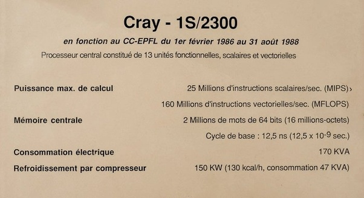

*Réponse publiée [sur Quora](https://fr.quora.com/%C3%80-quoi-ressemblaient-les-premiers-ordinateurs-domestiques-et-quelles-%C3%A9taient-leurs-capacit%C3%A9s-par-rapport-aux-smartphones-modernes/answer/Dr-Goulu)*

En 1986, j'avais un [Apricot XEN](w:Apricot), un PC presque compatible IBM, mais bien meilleur au niveau graphique.

Mais pour comparer aux smartphones actuels, il faut plutôt parler des superordinateurs de l'époque.

En 1986 j'étais étudiant en informatique à l'Ecole Polytechnique Fédérale de Lausanne (EPFL) lorsqu'elle s'est dotée d'un [Cray-1S/2300](w:en:Cray-1), le plus puissant ordinateur en Suisse à l:époque. Ses performances :

Étaient notamment utilisé pour des calculs de physique des plasmas, avec des logiciels suffisamment bien "vectorisés" pour être les premiers au monde à effectuer un milliard d'opérations en virgule flottante par seconde (1 [GigaFLOPS](w:FLOPS)) sur son successeur, le [Cray X-MP](w:en:Cray_X-MP)acquis en 1988

[https://www.museebolo.ch/memoire...](https://www.museebolo.ch/memoires_vives/un-voyage-dans-lage-dor-des-superordinateurs-cray-en-suisse/)

Aujourd'hui, les [processeurs Tensor](w:en:Google_Tensor) qui équipent les smartphones Pixel de Google atteignent 1000 GIGAFLOPS.

1 Smartphone actuel = 1000 superordinateurs Cray = à peu près toute la puissance de calcul et la mémoire des ordinateurs du monde entier dans les années 1980.
