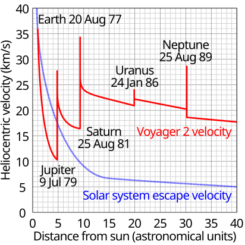

---

title: Comment se fait-il que les sondes spatiales que nous envoyons dans l'espace ne soient pas attirées par l'énorme force gravitationnelle du Soleil, alors que, pendant la majeure partie de leur voyage, elles n'allument pas leurs moteurs ?
slug: comment-se-fait-il-que-les-sondes-spatiales-que-nous-envoyons-dans-l-espace-ne-soient-pas-attirees-par-l-enorme-force-gravitationnelle-du-soleil-alors-que-pendant-la-majeure-partie-de-leur-voyage-elles-n-allument-pas-leurs-moteurs
date: '2025-03-04'
draft: true
categories:
- Comment
tags: []
coverImage: ./images/qimg-028b1003c38746a19a8dae78827cd0da.png
---

*Réponse publiée [sur Quora](https://fr.quora.com/Comment-se-fait-il-que-les-sondes-spatiales-que-nous-envoyons-dans-l-espace-ne-soient-pas-attir%C3%A9es-par-l-%C3%A9norme-force-gravitationnelle-du-Soleil-alors-que-pendant-la-majeure-partie-de-leur/answer/Dr-Goulu)*

Mais elles le sont, elles le sont !

La vitesse de la fusée s'additionne à celle de la Terre sur son orbite, 29.8 km/s

Il ne manque donc qu'une douzaine de km/s pour atteindre la 3ème [Vitesse cosmique](w:)de 42.1 km/s qui est la vitesse de libération du Soleil au niveau de l'orbite terrestre.

Sauf que cette vitesse doit être radiale par rapport au soleil, alors que la vitesse sur l'orbite terrestre ne l'est pas du tout.

C est pourquoi TOUTES les sondes lointaines utilisent l'[Assistance gravitationnelle](w:) des planètes en passant tout près pour modifier leur trajectoire et "convertir" leur vitesse orbitale en vitesse radiale par rapport au Soleil.

Voici par exemple la vitesse radiale de Voyager 2 en rouge, comparée à la vitesse de libération du Soleil en bleu, qui baisse rapidement en s'éloignant de la Terre.

On voit que la sonde a ralenti rapidement en allant vers Jupiter, qui l'a déviée sur une trajectoire vers Saturne en augmentant sa vitesse radiale au dessus de la vitesse de libération, au détriment de sa vitesse tangentielle, non représentée.

On a refait le coup avec Saturne, puis un peu avec Uranus, alors que Neptune a "freiné" la sonde, mais en la déviant dans une direction perpendiculaire au système solaire.

On voit que les dates de lancement de telles sondes sont très limitées, s'il y a un cas où les planètes doivent être favorables, c'est celui là…

Un aspect surprenant de ceci est qu'il est plus difficile d'envoyer une sonde vers Mercure ou le Soleil que vers l'extérieur du système solaire, car il faut fortement diminuer la vitesse tangentielle initiale de la sonde, qui vaut 29.8 km/s, idéalement à zéro si on voulait faire tomber la sonde sur le Soleil, alors qu'il suffit d'accélérer de quelques km/s pour aller vers Jupiter.

Et Mercure est si petite qu'il faut arriver lentement, bien tangentiellement si on ne veut pas la rater. Ça demande des trajectoires encore plus futées que celles de Voyager, voir [MESSENGER — Wikipédia](w:MESSENGER).

Bref, la sonde est propulsée par un étage de fusée au début pour s'écarter de la Terre, mais elle orbite toujours autour du Soleil. Elle a ensuite de petits moteurs qui lui permettent juste de corriger sa trajectoire pour bénéficier de l'assistance gravitationnelle.
