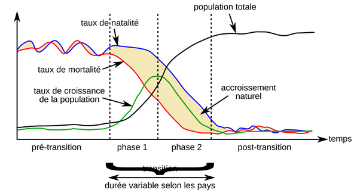
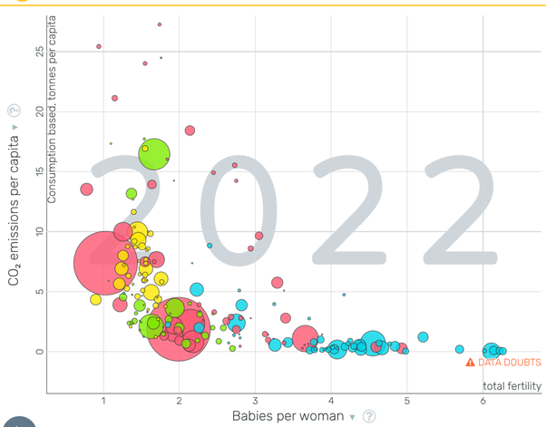

*Réponse publiée [sur Quora](https://fr.quora.com/Est-ce-que-la-chute-des-naissances-des-peuples-evolues-va-etre-assez-pour-arreter-le-rechauffement-planetaire/answer/Dr-Goulu)*

C'est quoi, les "peuples évolués" ?

Si vous vouliez dire "développés" par rapport à "sous développés", il n'y a plus de fossé entre eux, comme le montre le regretté Hans Rosling dans la première de ses [géniales conférences au TED](https://web.archive.org/web/20251215204530/https://www.ted.com/talks/hans_rosling_the_best_stats_you_ve_ever_seen)

[https://www.ted.com/talks/hans_r...](https://web.archive.org/web/20251215204530/https://www.ted.com/talks/hans_rosling_the_best_stats_you_ve_ever_seen)

Mais ce n'est qu'un exemple des préjugés et misconceptions contre lesquels il s'est battu avec des arguments purement scientifiques. (faites les tests sur son site [Gapminder](https://www.gapminder.org) ! )

Une de ces misconceptions transparaît dans votre question, qui suggère que la baisse de la natalité entraînerait une baisse de la population.

C'est carrément faux !

C'est l'inverse : c'est l'augmentation de la population qui provoque la baisse de la natalité !

Le mécanisme s'appelle [Transition démographique](w:):

1. avant la transition, le taux de mortalité (infantile) est très élevé. Il faut que chaque femme ait entre 6 et 8 enfants pour éviter que la population ne baisse.
2. arrivée à un certain niveau économique et d'éducation, la baisse de la mortalité grâce à une hygiène simple, l'accès aux vaccins et aux antibiotiques fait chuter la mortalité. C'est là que la population augmente rapidement.
3. ce n'est que lorsque les femmes s'aperçoivent que leurs enfants ne meurent plus avant l'âge adulte qu'elles font moins de 4 enfants (c'est le seuil conventionnel de la transition).
4. C'est le décalage temporel ppentre la baisse du taux de mortalité et celle du taux de natalité qui provoque une hausse rapide de la population.

Cette transition est pratiquement identique d'un pays à l'autre, juste décalée dans le temps : l'Europe l'a franchie fin 19ème - début 20ème siècle, l'Asie fin du 20ème, l'Afrique actuellement (la moitié des pays Africains ont désormais moins de 4 enfants par femme).

Cette augmentation rapide d'une population jeune fournit une capacité de travail qui permet une croissance économique rapide. "boomers" européens ou enfants uniques chinois, même combat …

En fait, comme Rosling l'explique dans une autre conférence, l'augmentation actuelle de la population mondiale est plus due à l'allongement de l'espérance de vie (des vieux…) qu'aux naissances …

Enfin, le lien entre natalité et émissions de CO2 est assez net, mais indirect :

[Source : gapminder](https://www.gapminder.org/tools/#$ui$chart$cursorMode=plus;;&model$markers$bubble$encoding$y$data$concept=co2_pcap_cons&space@=geo&=time;;&scale$domain:null&zoomed@:-0.58&:25.12;&type:null;;&x$data$concept=children_per_woman_total_fertility&space@=geo&=time;;&scale$domain:null&zoomed@:0.72&:6.31;&type:null;;&frame$value=2022;;;;;&chart-type=bubbles&url=v2)

Le problème est que la population et le niveau de vie ne sont que 2 des 4 facteurs de l'[équation de Kaya](w:Identité_de_Kaya) [[1]](#Rtjle) . On oublie facilement le facteur démographique, mais non, à moins de descendre à zéro, il ne suffira pas : si la population diminue de moitié mais que le PIB ou la consommation de ressources fossiles par habitant double dans le même temps, on a strictement rien gagné.

Notes de bas de page

[[1]](#cite-Rtjle)[équation de Kaya Archives - Pourquoi Comment Combien](https://drgoulu.com/tag/equation-de-kaya/)
