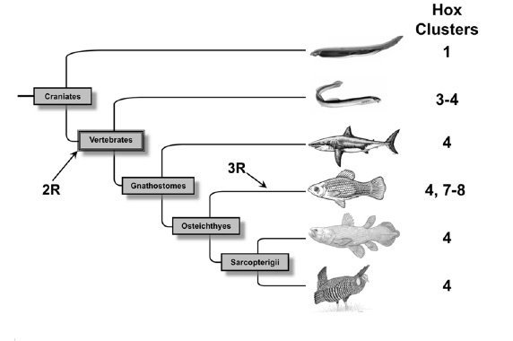

*Réponse publiée [sur Quora](https://fr.quora.com/Y-a-t-il-eu-un-exp%C3%A9riment-scientifique-d%C3%A9montrant-que-la-vie-non-complexe-peut-donner-naissance-%C3%A0-des-formes-de-vie-plus-complexes/answer/Dr-Goulu)*

C'est encore mieux que ça : on le constate chez des êtres vivants aujourd'hui ! Même pas besoin de faire une expérience !

Votre question naïve cache en fait une excellente question scientifique : comment un génome peut s'allonger, pour accueillir plus de gènes, donc former des cellules plus complexes ?

Et bien on connaît plusieurs mutations ou accidents qui [Dupliquent du matériel génétique](w:Duplication_(génétique)), soit un gène, soit tout un chromosome. Et quand ça arrive, ce n'est pas (toujours) grave pour l'individu. Il peut même se reproduire et transmettre ses gènes "augmentés" à sa descendance, qui aura ainsi un avantage évolutif en ayant plus de possibilités de s"adapter.

Aujourd'hui avec les techniques de séquençage ADN on peur prouver que de telles mutations sont arrivées il y a très longtemps, notamment plusieurs qui ont formé les vertébrés.

Le graphique suivant illustre ceci : les animaux actuels correspondant à cet arbre ont des génomes de taille double de ceux plus haut dans l'arbre :

Mais comme dit plus haut, il y a des exemples actuels de ce phénomène naturel :

> Des duplications du génome récentes datant de moins de 150 ans ont été identifiées chez de nombreuses plantes tels que chez les [salsifis](w:) où les espèces *Tragopogon mirus* et *Tragopogon miscellus* sont apparues il y a environ 80 ans par allotétraploïdie.

Il y a de nombreuses preuves de duplications partielles chez l'être humain, je vous laisse les découvrir dans l'article Wikipedia, c'est passionnant. Mais un peu technique quand même.

[Duplication (génétique)](w:Duplication_\(génétique\))
