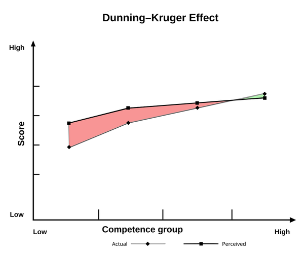

*Réponse publiée [sur Quora](https://fr.quora.com/Qui-se-sent-le-plus-intelligent-entre-un-idiot-et-un-g%C3%A9nie/answer/Dr-Goulu)*

[Effet Dunning-Kruger](w:):

Dans la zone rouge, les participants moins compétents surestiment leur compétence ; dans la zone verte, les plus compétents ont tendance à sous-estimer leur compétence.
