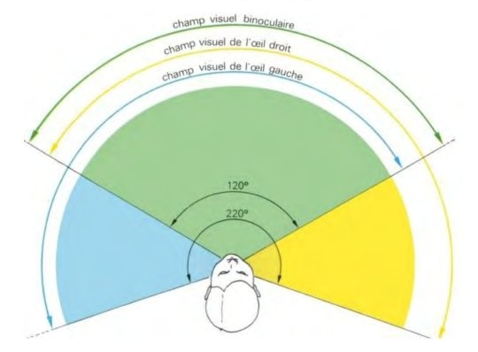

*Réponse publiée [sur Quora](https://fr.quora.com/Pourquoi-lorsque-l-on-ferme-un-oeil-notre-vision-est-remplie-de-ce-que-voit-notre-oeil-ouvert-comme-si-notre-oeil-ferm%C3%A9-n-existait-pas-mais-lorsque-nos-deux-yeux-sont-ferm%C3%A9-on-voit-du-noir/answer/Dr-Goulu)*

Essayez encore, en regardant droit devant vous : vous avez une zone d'environ 50 degrés qui d'obscurcit du côté de l'œil fermé ou caché

Ça passe presque inaperçu car une grande partie de votre champ visuel est couverte par les deux yeux.
