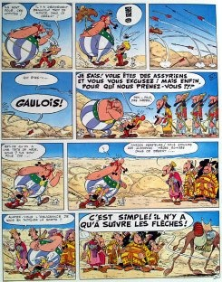

*Réponse publiée [sur Quora](https://fr.quora.com/Avec-ce-nouveau-conflit-d%C3%A9clench%C3%A9-au-Moyen-Orient-comment-voyez-vous-son-avenir-%C3%A0-terme/answer/Dr-Goulu)*

Comme dans les millénaires passés et les millénaires futurs : cette région est condamnée aux conflits perpétuels.

Elle se situe entre des continents, sur des routes maritimes importantes, et le pétrole augmente encore sa valeur géostratégique.

Une autre région comme ça, en légèrement moins stratégique, c'est l'Amérique centrale.

Jouez à Civilization, vous comprendrez.
