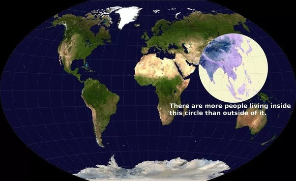

*Réponse publiée [sur Quora](https://fr.quora.com/Pourquoi-le-monde-part-s%C3%A9rieusement-en-couilles-comme-la-dit-un-Fran%C3%A7ais-sur-Youtube/answer/Dr-Goulu)*

Parce que ce français regarde son nombril.

La majorité de la population mondiale vit dans ce cercle. J'y suis actuellement et je peux vous dire que les gens ne se plaignent pas. Ils bossent, ils voient leur avenir s'améliorer d'année en année. Leurs parents étaient des cultivateurs de riz depuis des générations, eux ils sont chauffeurs de taxi et leurs enfants seront ingénieurs.

Ca construit des éoliennes et des panneaux solaires partout, il y a plus de scooters électriques que de vélos.

Il y a encore plein de problèmes, mais ici les gens s'attaquent à les résoudre au lieu de pleurnicher.

Mais c'est vrai qu'ils ont un avantage décisif : si ça ne marche pas, ils se réincarnent et recommencent.
