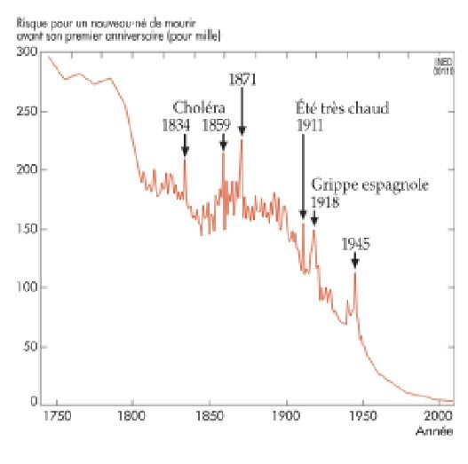

*Réponse publiée [sur Quora](https://fr.quora.com/Pourquoi-les-gens-pouvaient-ils-avoir-sept-ou-huit-enfants-autrefois-Et-pourquoi-ce-nombre-a-t-il-diminu%C3%A9-aujourd-hui/answer/Dr-Goulu)*

Ils pouvaient parce que les deux tiers des enfants n'atteignaient pas l'âge adulte

Encore au début du 20ème siècle, en France, environ 15% des bébés mourraient avant l'âge d'un an :

Ce qui s'est passé en Europe, puis en Asie , et actuellement en Afrique s'appelle la [Transition démographique·](w:Transition_démographique)

> passage d’un régime traditionnel où la fécondité et la mortalité sont élevées et s’équilibrent à peu près, à un régime où la natalité et la mortalité sont faibles et s’équilibrent également. Pendant la transition entre les deux régimes, le taux de mortalité diminue d'abord, créant une première phase d'accélération de la croissance démographique et un fort accroissement naturel de la population. Puis la baisse de la natalité devient plus rapide que la baisse de la mortalité, ce qui induit un ralentissement de la croissance naturelle.
>
>
>
> [Wikipédia](w:Transition_démographique)

C'est absolument essentiel de comprendre ça : la croissance de la population n'est pas provoquée par le fait d'avoir beaucoup d'enfants, mais parce qu'ils ne meurent plus.
